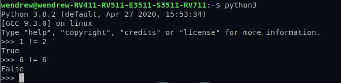
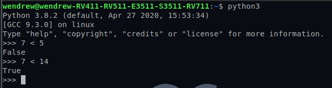
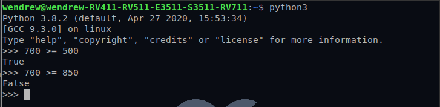
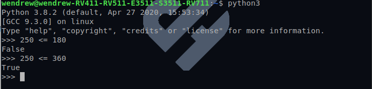

## Comparando objetos com o operador ==

- Imagina a situação em que temos uma biblioteca e nela temos um acervo de diversos livros. Digamos que quero ver se um livro ja existe no meu acervo;

Temos uma lista de livros

```python
    livros = [
        "Harry potter e a pedra filosofal",
        "Cidades de papel",
        "O Anticristo",
        "Além do Bem e do Mal",
        "Ecce homo",
    ]
```

Agora, quero ver se algum livro dos quais tenho na lista, ja existe comparados com os livros novos que recebi de uma editora. Para isso, vamos usar a seguinte função:

```python
In[]:

    def verifica_livro(livro_procurado):
        meus_livros = funcao_lista_todos_livros()
        for livro in meus_livros:
            if livro_procurado == livro:
                return True
        return False

    livro_procurado = "Ecce homo"

    if verifica_livro(livro_procurado):
        print("Tenho o livro!")
    else:
        print("Não tenho o livro!")
```
*__OBS__: esse é apenas um exemplo generico.*

Ao rodarmos o codigo, o resultado sera esse:

```python
Out[]:

    Tenho o livro!
```
<br>

## Simplificando nossa verificação com o operador in

- Podemos, ainda, simplificar o código em nossa função verifica_livro() utilizando o operador __in__ para verificar se o livro já está na lista, já que este operador também se baseia no retorno de __==__.


```python

    def verifica_livro(livro_procurado):
        meus_livros = funcao_lista_todos_livros()
        return livro_procurado in meus_livros
```

## Comparando objetos com o operador !=

- Esse operador tem como objetivo comparar a diferença dos itens. Veja o exemplo abaixo:



- Este operador compara duas coisas, e retorna True se forem diferentes e False se forem iguais.


## Comparando objetos com o operador <

- Ao fazer: __x < y__, estamos perguntando ao Python se __x__ é menor que __y__,
Se ele for menor mesmo, retorna *True*.
Se for igual ou maior que __y__, retorna *False*.



## Comparando objetos com o operador >

- Quando fazemos: __x > y__, estamos querendo saber se __x__ é maior que __y__.
Se for verdade, retorna *True*.
Se __x__ por igual ou menor que __y__, retorna *False*.


## Comparando objetos com o operador >= 

Na operação: __x >= y__
Você deve ler: __x__ maior ou igual a __y__

Esse operador vai retornar *True* (verdadeiro) se __x__ for igual a __y__ ou se __x__ for maior que __y__.
Vai retornar *False* apenas se __x__ for menor que __y__.



## Comparando objetos com o operador <= 

Na operação: __x <= y__
Você deve ler: __x__ menor ou igual a __y__

Retorna *True* se __x__ for igual a __y__ ou menor.
Se __x__ for maior que __y__, retorna *False*.



## Resumindo...


|   Operação    | Comparação |
| ------------- | -------------  |
|   __x == y__      | __x__ é igual a __y__?|
|   __x != y__      | __x__ é diferente de __y__?   |
|   __x > y__      | __x__ é maior que __y__?   |
|   __x < y__      | __x__ é menor que __y__?   |
|   __x >= y__      | __x__ é maior ou igual a __y__?   |
|   __x <= y__      | __x__ é menor ou igual a __y__?  |


## É bom saber

- todas as operações de comparação em Python têm a mesma prioridade.
         
         
         
         
        
         