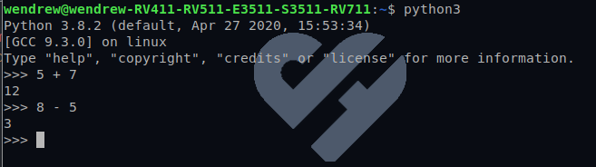

## Expressões aritméticas

- Uma expressõe aritmética é formada por numeros (chamados de operandos) e operadores;
- Abaixo veremos um exemplo de uma operação matematica simples, contendo apenas dois operandos e um operador:




## Operadores logicos

- Há três operadores logicos, sendo eles, __and__, __or__ e __not__. Sua semantica/significado é o mesmo do que no ingles;

Vejamos alguns exemplos teoricos:

__and__:
```python
    x>0 and x<10
```

A expressão acima só retornará *true* caso as duas condições forem cumpridas. Ou seja, se ambos os casos a variavel *x* for maior que zero e menor que 10.
<br>

__or__:
```python
    n%2 == 0 or n%3 == 0
```

A expressão acima só retornará *true* caso uma das duas condições forem cumpridas. Isto é, se o número for divisível por 2 ou 3.
<br>

__not__:
Finalmente, o operador not nega uma expressão booleana, então __not(x > y)__ é verdade se __x > y__ for falso, isto é, se __x__ for menor que ou igual a __y__.
<br>