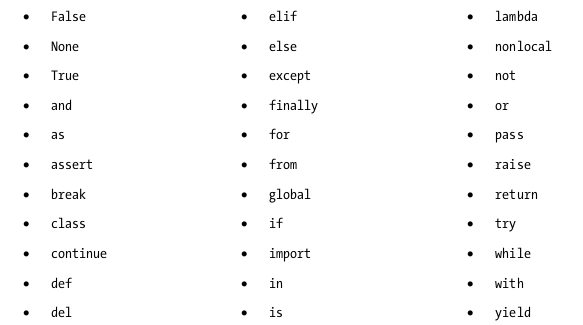
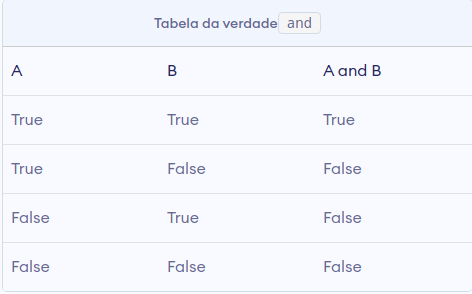
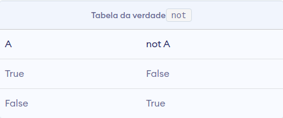
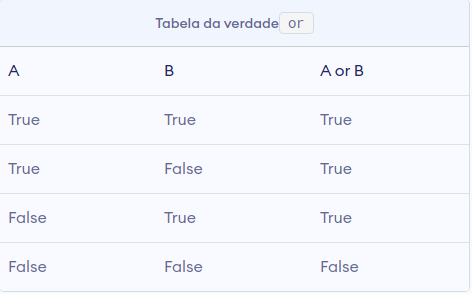

<h1>Palavras-reservadas (Keywords)</h1>
<br>

- Python tem um conjunto de palavras-chave que são palavras reservadas que não podem ser usadas como nomes de variáveis, nomes de funções ou quaisquer outros identificadores:



##### Explicando as palavras chaves

- **True, False**:
  - eles são os resultados de operações de comparação ou operações lógicas (booleanas) em Python:
    <br>
    ```python
        >>> 666 == 666
        True
        >>> n = 250
        >>> if n > 250:
        ...     print(False)
        ... else:
        ...     print(True)
        ... 
        True
        >>> 10 >= 20
        False

    ```
<br>

- **None**:
  - é uma constante especial em Python que representa a ausência de um valor ou um valor nulo;

  - É um objeto de seu próprio tipo de dados, o NoneType. Não podemos criar vários objetos None, mas podemos atribuí-los a variáveis. Essas variáveis ​​serão iguais umas às outras:

    ```python

        >>> None == 0
        False
        >>> None = []
        File "<stdin>", line 1
        SyntaxError: cannot assign to None
        >>> None == []
        False
        >>> None == False
        False
        >>> x = None
        >>> y = None
        >>> x == y
        True
    ```

  - Quando uma função não encontra a declaração **return**, a mesma retorna **None**:

    ```python
    In[]:  

        def a_void_function():
            a = 1
            b = 2
            c = a + b

        x = a_void_function()
        print(x)
    ```

    ```python
    Out[]:  

        None
    ```
<br>

- **and, or , not**:
  - **and, or, not** são os operadores lógicos em Python. e resultará em True apenas se ambos os operandos forem True. A tabela de verdade para e é fornecida abaixo:
    <br>

    <br>
    <br>
    <br>
<br>

- **as**:
  - **as** é usado para criar um alias durante a importação de um módulo. Significa dar um nome diferente (definido pelo usuário) a um módulo durante a importação. Por exemplo:

    ```python
        >>> import math as mt
        >>> mt.cos(mt.pi)
        -1.0
    ```

    
    Aqui, importamos o módulo *math* dando a ele o nome de *mt*. Agora podemos nos referir ao módulo matemático com este nome. Usando esse nome, calculamos cos (pi) e obtivemos -1,0 como resposta.
<br>

- **assert**:
  - Durante a programação, às vezes desejamos saber o estado interno ou verificar se nossas suposições são verdadeiras. O termo **assert** nos ajuda a fazer isso e encontrar bugs de maneira mais conveniente. assert é seguido por uma condição.
  - **assert** é usado para fins de depuração:

    ```python
        
        >>> a = 4
        >>> assert a < 5
        >>> assert a > 5
        Traceback (most recent call last):
        File "<string>", line 301, in runcode
        File "<interactive input>", line 1, in <module>
        AssertionError
    ```
  - Para melhor entendimento, também podemos disponibilizar uma mensagem a ser impressa com o AssertionError:

    ```python

        >>> a = 4
        >>> assert a > 5, "The value of a is too small"
        Traceback (most recent call last):
        File "<string>", line 301, in runcode
        File "<interactive input>", line 1, in <module>
        AssertionError: The value of a is too small
    ```

  - Isso:

    ```python

        assert condition, message
    ```

  - É equivalente a isso:

    ```python

        if not condition:
            raise AssertionError(message)
    ```
<br>

- **async, await**:
  - As palavras-chave **async** e **await** são fornecidas pela biblioteca **asyncio** em Python. Eles são usados ​​para escrever código simultâneo em Python. Por exemplo: 

    ```python
    In[]:

        import asyncio


        async def main():
            print('Hello')
            await asyncio.sleep(1)
            print('world')
    ```

   - Rode o programa com:

      ```sh
          asyncio.run(main())
      ```

   - No programa acima, a palavra-chave **async** especifica que a função será executada de forma assíncrona;

   - Primeiramente, *Hello* é impresso. A palavra-chave **await** faz o programa esperar 1 segundo. E então a palavra *mundo* é impressa.
<br>
  
- **break, continue**:
  - **break** e **continue** são usados ​​dentro dos loops *for* e *while* para alterar seu comportamento normal.

  - **break** finaliza a iteração e o script continua a execução normalmente. O objetivo dessa instrução é fornecer a capacidade de forçar a interrupção da iteração. 
  - **continue** encerra a iteração atual do loop, mas não o loop inteiro. 
  - Podemos ver o uso de ambas as declarações, nos seguintes exemplos:
  
    ```python
    In[]:

        for i in range(1,11):
            if i == 5:
                break
            print(i)
    ```
    ```python
    Out[]:
    
        1
        2
        3
        4
    ```
    Aqui usamos continue para o mesmo programa. Portanto, quando a condição é atendida, essa iteração é ignorada. Mas não saímos do loop. Portanto, todos os valores, exceto 5, são impressos.
    <br>

    ```python
    In[]:

        for i in range(1,11):
            if i == 5:
                continue
            print(i)
    ```
    ```python
    Out[]:
    
        1
        2
        3
        4
        6
        7
        8
        9
        10
    ```

    Aqui usamos **continue** para o mesmo programa. Portanto, quando a condição é atendida, essa iteração é ignorada. Mas não saímos do loop. Portanto, todos os valores, exceto 5, são impressos.
    <br>
<br>

- **class**:
  - **class** é usado para definir uma nova classe em Python;
  - Classe é uma coleção de atributos e métodos relacionados que tentam representar uma situação do mundo real. Essa ideia de colocar dados e funções juntos em uma classe é central para o conceito de programação orientada a objetos (OOP).

  ```python

    class ExampleClass:
      def function1(parameters):
        ...
      def function2(parameters):
        ...
  ```
<br>

- **def**:
  - **def** é usado para definir uma nova função em Python;
  - Função é um bloco de instruções relacionadas, que juntas executam alguma tarefa específica. Isso nos ajuda a organizar o código em partes gerenciáveis ​​e também a fazer algumas tarefas repetitivas.

  ```python

    def function_name(parameters):
      ...
  ```
<br>

- **del**:
  - **del** é usado para excluir a referência a um objeto. Tudo é objeto em Python. Podemos deletar uma referência de variável usando **del**:

    ```python

      >>> a = b = 5
      >>> del a
      >>> a
      Traceback (most recent call last):
        File "<string>", line 301, in runcode
        File "<interactive input>", line 1, in <module>
      NameError: name 'a' is not defined
      >>> b
      5
    ```
  - Podemos também, remover um item de uma lista, por exemplo:

    ```python

      >>> a = ['x','y','z']
      >>> del a[1]
      >>> a
      ['x', 'z']
    ```
<br>

- **if, else, elif**
  - if, else, elif são usados ​​para tomadas de decisão;
  - Quando queremos testar alguma condição e executar um bloco apenas se a condição for verdadeira, usamos if e elif. elif é a abreviação de else if. else é o bloco que é executado se a condição for falsa. Isso ficará claro com o seguinte exemplo:

    ```python
    In[]:

      def if_exemplo(a):
        if a == 1:
            print('Um')
        elif a == 2:
            print('Dois')
        else:
            print('outra coisa...')

      if_exemplo(2)
      if_exemplo(4)
      if_exemplo(1)
    ```
    ```python
    Out[]:

      Dois
      outra coisa...
      Um
    ```

  Aqui, a função verifica o número de entrada e imprime o resultado se for 1 ou 2. Qualquer entrada diferente desta fará com que a outra parte do código seja executada.
<br>

- **except, raise, try**:
  - **except, raise, try** são usados para tratar exceções em Python;
  - As exceções são basicamente erros que sugerem que algo deu errado durante a execução de nosso programa. IOError, ValueError, ZeroDivisionError, ImportError, NameError, TypeError etc. são alguns exemplos de exceção em Python. **try ... except** são blocos usados ​​para capturar exceções em Python.

    ```python
    In[]:

      def function_name(num):
        try:
            r = 1/num
        except:
            print('Exceção...')
            return
        return r

      print(function_name(10))
      print(function_name(0))
    ```
    ```python
    Out[]:

      0.1
      Exceção...
      None
    ```
<br>

- **finally**:
 - É usado juntamente aos blocos **try ... except**;
 - O uso do **finally** garante que o bloco de código dentro dele seja executado mesmo se houver uma exceção não tratada. Por exemplo:

    ```python

      try:
        Try-block
      except exception1:
        Exception1-block
      except exception2:
        Exception2-block
      else:
        Else-block
      finally:
        Finally-block
    ```
    Aqui, se houver uma exceção no bloco **try**, ela será tratada no bloco **except** ou **else**. Mas não importa em que ordem a execução flua, o bloco **finally** é executado mesmo se houver um erro.
<br>

- **for**:
  - **for** é usado para *loop*. Geralmente usamos para quando sabemos o número de vezes que queremos fazer um *loop*;
  - Em Python, podemos usá-lo com qualquer tipo de sequência, como uma *lista* ou uma *string*. Aqui está um exemplo em que **for** é usado para percorrer uma *lista de nomes*:

    ```python
    In[]:

      names = [
        'Lucas',
        'Joana',
        'Monica',
        'João'
      ]
      for i in names:
        print('Olá '+i)
    ```
    ```python
    Out[]:

      Olá Lucas
      Olá Joana
      Olá Monica
      Olá João
    ```
<br>

- **from, import**:
  - A palavra-chave **import** é usada para importar módulos para o *namespace* atual. **from ... import** é usado para importar atributos ou funções específicos para o *namespace* atual. Por exemplo: 

    ```python

      import math
    ```
  - A importação acima irá importar o módulo *math*. Agora podemos usar a função *cos()* dentro dele como *math.cos()*. Mas se quisermos importar apenas a função *cos()*, podemos fazer assim:

    ```python

      from math import cos
    ```
<br>

- **global**:
  - É usado para declarar que uma variável dentro da função é global (fora da função);
  - Se precisarmos ler o valor de uma variável **global**, não é necessário defini-la como **global**;
  - Se precisarmos modificar o valor de uma variável **global** dentro de uma função, devemos declará-lo com **global**;
  - O exemplo a seguir nos ajudará a esclarecer isso:

    ```python
    In[]:

      global_var = 10
      def read1():
          print(global_var)
      def write1():
          global global_var
          global_var = 5
      def write2():
          global_var = 15

      read1()
      write1()
      read1()
      write2()
      read1()
    ```
    ```python
    Out[]:

      10
      5
      5
    ```
    Aqui, a função *read1()* está apenas lendo o valor de *globvar*. Portanto, não precisamos declará-lo como **global**. Mas a função *write1()* está modificando o valor, portanto, precisamos declarar a variável como **global**.
<br>

- **in**:
  - **in** é usado para testar se uma sequência (*lista, tupla, string*, etc...) contém um valor. Retorna **True** se o valor estiver presente, caso contrário, retorna **False**. Por exemplo:

    ```python

      >>> a = [1, 2, 3, 4, 5]
      >>> 5 in a
      True
      >>> 10 in a
      False
    ```
    Ou, podemos usa-lo em um loop **for**:
    ```python
    In[]:

      for i in 'hello':
        print(i)
    ```
    ```python
    Out[]:

      h
      e
      l
      l
      o
    ```
<br>

- **is**:
  - É usado em Python para testar a identidade do objeto. Enquanto o operador **==** é usado para testar se duas variáveis ​​são iguais ou não, **is** é usado para testar se as duas variáveis ​​se referem ao mesmo objeto;
  - Retorna **True** se os objetos são idênticos e **False** se não são.

    ```python

      >>> True is True
      True
      >>> False is False
      True
      >>> None is None
      True
    ```
<br>

- **lambda**:
  - **lambda** é usado para criar uma função anônima (função sem nome). É uma função embutida que não contém uma instrução de retorno. Consiste em uma expressão que é avaliada e retornada. Por exemplo:

    ```python
    In[]:

      a = lambda x: x*2
      for i in range(1,6):
          print(a(i))
    ```
    ```python
    Out[]:

      2
      4
      6
      8
      10
    ```
<br>

- **nonlocal**:
  - O uso de palavras-chave não locais é muito semelhante à palavra-chave global. nonlocal é usado para declarar que uma variável dentro de uma função aninhada (função dentro de uma função) não é local para ela, significando que está na função de fechamento externo. Se precisarmos modificar o valor de uma variável não local dentro de uma função aninhada, devemos declará-la com nonlocal. Caso contrário, uma variável local com esse nome é criada dentro da função aninhada. O exemplo a seguir nos ajudará a esclarecer isso:

    ```python
    In[]:

      def outside_function():
        a = 5
        def inner_function():
            nonlocal a
            a = 10
            print("Função interna: ",a)
        inner_function()
        
        print("Função externa: ",a)

      outside_function()
    ```
    ```python
    Out[]:

      Função interna:  10
      Função externa:  10
    ```
    Aqui, a *inner_function()* está aninhada na *outside_function()*.

    A variável **a** está em *outer_function()*. Portanto, se quisermos modificá-lo em *inner_function()*, devemos declará-lo como não local. Observe que **a** não é uma variável global.
<br>

- **pass**:
  - **pass** é uma instrução nula em Python. Nada acontece quando é executado. Ele é usado como um espaço reservado;
  - Suponha que temos uma função que ainda não foi implementada, mas queremos implementá-la no futuro. Simplesmente escrevemos:

    ```python

      def function_name(args):
        pass
    ```
  - Podemos fazer o mesmo com uma classe:

    ```python

      class ExampleClass:
        pass
    ```
<br>

- **return**:
  - A instrução **return** é usada dentro de uma função para sair dela e retornar um valor;

  - Se não retornarmos um valor explicitamente, **None** é retornado automaticamente. Isso é mostrado no exemplo a seguir:

    ```python
    In[]:

      def func_return():
        a = 10
        return a

      def no_return():
        a = 10

      print(func_return())
      print(no_return())
    ```
    ```python
    Out[]:

      10
      None
    ```
<br>

- **while**:
  - **while** é usado para *loop* em Python;
  - As instruções dentro de um *loop* **while** continuam a executar até que a condição para o *loop* **while** seja avaliada como *False* ou uma instrução **break** seja encontrada. O programa a seguir ilustra isso:

    ```python
    In[]:

      i = 5
      while(i):
        print(i)
        i = i – 1
    ```
    ```python
    Out[]:

      5
      4
      3
      2
      1
    ```
    Repare que 0 é igual a *False*.
<br>

- **with**:
  - É usado para envolver a execução de um bloco de código dentro dos métodos definidos pelo gerenciador de contexto;
  - O gerenciador de contexto é uma classe que implementa os métodos **__enter__** e **__exit__**. O uso da instrução with garante que o método **__exit__** seja chamado no final do bloco aninhado. Este conceito é semelhante ao uso do bloco **try ... finally**. Por exemplo:

    ```python

      with open('exemplo.txt', 'w') as arq:
        arq.write('Olá, mundo!')
    ```
    Nesse exemplo escrevemos o texto *Olá, mundo!* dentro do o arquivo exemplo.txt. Os objetos de arquivo têm os métodos **__enter__** e **__exit__** definidos dentro deles, de modo que atuam como seu próprio gerenciador de contexto.

    Primeiramente, o método **__enter__** é chamado, então o código dentro da instrução é executado e, finalmente, o método **__exit__** é chamado. O método **__exit__** é chamado mesmo se houver um erro. Basicamente, fecha o fluxo de arquivos.
<br>

- **yield**:
  - É usado dentro de uma função como uma instrução de retorno. Mas retorna um **generator**;
  - **Generator** é um iterador que gera um item por vez;
  - Imagine uma grande lista de valores que ocupará muita memória. Os **generators** são úteis nessa situação, pois geram apenas um valor por vez, em vez de armazenar todos os valores na memória. Por exemplo:

    ```python

      >>> g = (2**x for x in range(100))
    ```
    irá criar um gerador **g** que gera potências de 2 até o número dois elevado à potência 99. Podemos gerar os números usando a função *next()* conforme mostrado abaixo:

    ```python

      >>> next(g)
      1
      >>> next(g)
      2
      >>> next(g)
      4
      >>> next(g)
      8
      >>> next(g)
      16
    ```

    E assim por diante ... 
    <br>
  - Este tipo de gerador é retornado pela declaração de **yield** de uma função. Aqui está um exemplo:

    ```python
    In[]:

      def generator():
        for i in range(6):
            yield i*i

      g = generator()
      for i in g:
        print(i)
    ```
    ```python
    Out[]:

      0
      1
      4
      9
      16
      25
    ```
    Aqui, a função *generator()* gera quadrados de números de 0 a 5. Isso é impresso no *loop* **for**.
<br>

