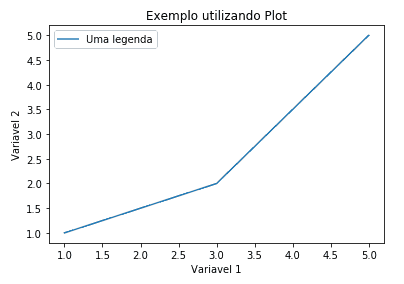

## Graficos aprimorados


- No [capítulo anterior](/Gerando-gráficos/grafico_simples.md), vimos uma forma básica de como gerar um gráfico, agora vamos um pouco mais além;

- No próximo exemplo foram inseridos mais parâmetros para criar um gráfico mais completo e com mais informações:

```python
In[]:

    # Definindo variáveis
    x = [1, 3, 5]
    y = [1, 2, 5]

    # Criando um gráfico e atribuindo etiquetas
    plt.plot(x, y, linewidth=2, linestyle='--', marker='o', label = 'Uma legenda')
    plt.plot(y, x, linewidth=2, linestyle=':', marker='D', label = 'Outra legenda')

    # Atribuindo um título ao gráfico
    plt.title('Exemplo utilizando Plot')
    plt.xlabel('Variavel 1')
    plt.ylabel('Variavel 2')

    # Aplicando legenda
    plt.legend()

    # Exibindo o gráfico gerado
    plt.show()
```

```python
Out[]:
```
<p align ="center"></p>

Existem outras propriedades que não foram incluídas nesse exemplo, [clique aqui](https://matplotlib.org/api/_as_gen/matplotlib.pyplot.plot.html) para mais informações.