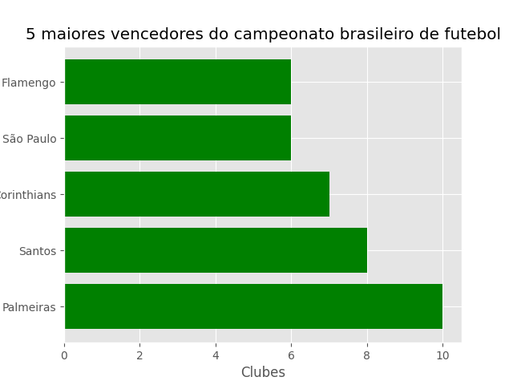

## Grafico de barras

- Os gráficos de barras são usados ​​para exibir valores associados aos dados categóricos;
- A função __plt.bar()__, recebe uma lista de posições e valores;
- Os labels para *x* são fornecidos pela função __plt.xticks()__.


## Gerando um grafico de barras simples

- Vamos gerar uma grafico de barras com o tema futebolistico;

- Nesse grafico, mostraremos os 5 maiores campeões brasileiros de futebol.

```python
In[]:

    import matplotlib.pyplot as plt


    plt.style.use('ggplot')

    x = ['Palmeiras', 'Santos', 'Corinthians', 'São Paulo', 'Flamengo']
    quant = [10, 8, 7, 6, 6]

    x_pos = [i for i, _ in enumerate(x)]

    plt.bar(x_pos, quant, color='green')
    plt.xlabel("Clubes")
    plt.ylabel("Campeonatos Brasileiros")
    plt.title("5 maiores vencedores do campeonato brasileiro de futebol")

    plt.xticks(x_pos, x)

    plt.show()

```

```python
Out[]:
```
<p align ="center"></p>


## Curiosidades...

- Podemos gerar o gráfico na horizontal também, sem muito esforço, usando a função __plt.barh()__:

```python
In[]:

    import matplotlib.pyplot as plt


    plt.style.use('ggplot')

    x = ['Palmeiras', 'Santos', 'Corinthians', 'São Paulo', 'Flamengo']
    quant = [10, 8, 7, 6, 6]

    x_pos = [i for i, _ in enumerate(x)]

    plt.barh(x_pos, quant, color='green')
    plt.xlabel("Clubes")
    plt.ylabel("Campeonatos Brasileiros")
    plt.title("5 maiores vencedores do campeonato brasileiro de futebol")

    plt.yticks(x_pos, x)

    plt.show()

```

```python
Out[]:
```
<p align ="center"></p>
