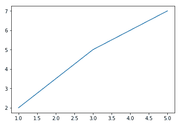

## Gerando um gráfico simples

- Nesse capitulo usaremos a biblioteca Matplotlib, para saber mais sobre ela, [clique aqui](/Gerando-gráficos/como_funciona.md);
- Basicamente, a ferramenta Matplotlib gera um gráfico de duas dimensões, onde na parte de baixo fica o eixo X, a esquerda o eixo Y e, entre eles, nossos dados.

#### Visualização de dados com PyPlot

- O PyPlot é um módulo do matplotlib para criação de gráficos. Para utilizá-lo é necessário fazer a importação:

```python
    import matplotlib.pyplot as plt
```
- Após importar o módulo, já é possível criar gráficos de uma forma simples e com poucos comandos, conforme pode ser visto no exemplo abaixo:

```python
In[]:
    # Criando um gráfico
    plt.plot(
        [1, 3, 5], 
        [2, 5, 7]
    )
    plt.show()
```
```python
Out[]:
```
<p align ="center"></p>

- Dessa forma, criamos o mais simples dos graficos com python utilizando a biblioteca matplotlib.