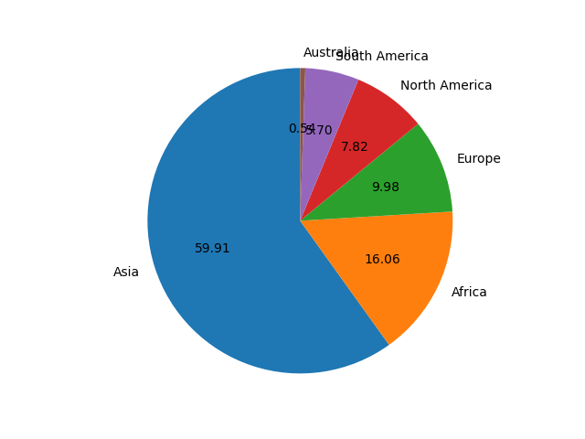

## Pie Chart

- O que é um __pie chart__?
__R:__ *É um diagrama estatístico circular*.
<br>
- A área do gráfico inteiro representa 100% ou o conjunto dos dados;
- As partes de um gráfico de pizza são chamadas de fatias.
- As fatias presentes no pie chart representam a porcentagem de partes dos dados.


## Desenhando um gráfico de pizza simples usando o Python Matplotlib

- Os gráficos de pizza podem ser desenhados usando a função __pie()__ no módulo *pyplot*. O exemplo de código python abaixo desenha um gráfico de pizza usando a função __pie()__.

```python
In[]:

    import matplotlib.pyplot as plt


    pieLabels = 'Asia', 'Africa', 'Europe', 'North America', 'South America', 'Australia'
    populationShare = [59.69, 16, 9.94, 7.79, 5.68, 0.54]

    figureObject, axesObject = plt.subplots()

    axesObject.pie(
        populationShare,
        labels=pieLabels,
        autopct='%1.2f',
        startangle=90
    )
    axesObject.axis('equal')
    
    plt.show()
```

```python
Out[]:
```
<p align ="center"></p>

__Obs:__ Por padrão, a função __pie()__ do *pyplot* organiza as fatias em um gráfico de pizza no sentido anti-horário.