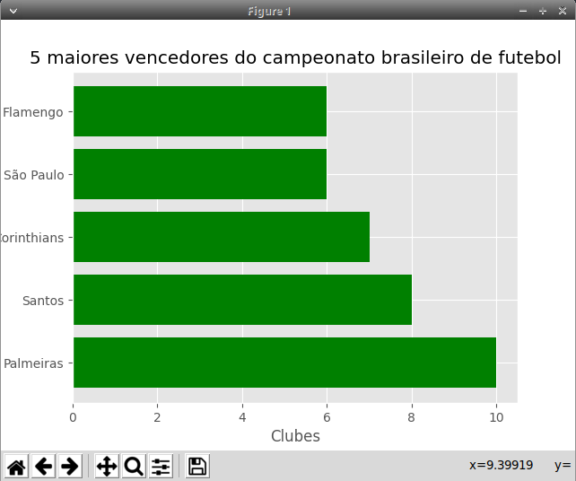
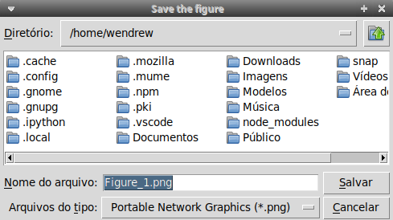

## Salvando uma imagem do grafico gerado

- Com o matplotlib podemos salvar um grafico como imagem para utilizar em relatórios, por exemplo;

- É muito simples realizar tal operação. Essa opção aparece na propria interface da biblioteca:

<p align ="center"></p>

- A barra inferior da interface é onde encontrará esse icone: . Clique nele e a seguinte tela aparecerá:

<p align ="center"></p>

- Escolha o diretorio onde quer salvar a imagem gerada e o nome do arquivo, após isso clique no botão *salvar* e pronto, sua figura ja esta salva no local escolhido.

### Forma alternativa
- Além da possibilidade de salvar os gráficos utilizando a interface da biblioteca, é possível salvar por meio de código.

- Utilizando a função `plt.savefig('nome_do_gráfico.formato')`, é possivel salvar o gráfico em diferentes formatos. Os formatos incluem: .png, .svg e .jpg.

- Exemplo:

```python
plt.plot(
    [1, 3, 5], 
    [2, 5, 7]
)
plt.savefig('grafico.png')
plt.show()
```

- Se desejar saber outros formatos disponíveis, a função `plt.gcf().canvas.get_supported_filetypes()` retorna a lista dos formatos suportados.