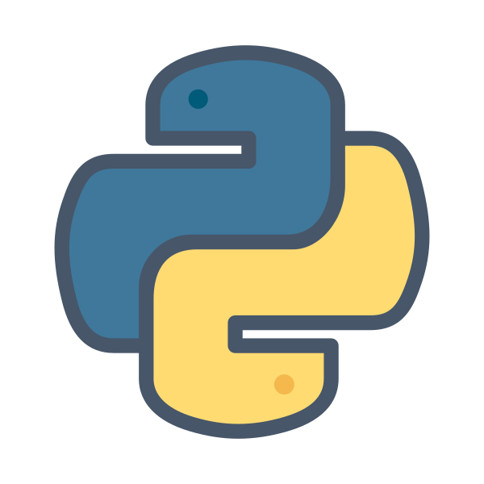

  

# Historia

Python é uma linguagem de programação de alto nível e uso geral, foi criada por Guido van Rossum em 1991 e posteriormente desenvolvido pela Python Software Foundation.

## É usado para:

- desenvolvimento web (lado do servidor);
- desenvolvimento de software;
- matemática;
- analise de dados;
- inteligencia artificial (I.A).

## Zen do Python

- O Zen do Python é uma coleção de princípios, para escrever programas de computador que influenciam o design da linguagem de programação Python.

  - Bonito é melhor que feio.
  - Explícito é melhor que implícito.
  - Simples é melhor que complexo.
  - Complexo é melhor que complicado.
  - Plano é melhor que aglomerado.
  - Esparso é melhor que denso.
  - Legibilidade faz diferença.
  - Casos especiais não são especiais o bastante para quebrar as regras.
  - Embora a praticidade vença a pureza.
  - Erros nunca devem passar silenciosamente.
  - A menos que sejam explicitamente silenciados.
  - Diante da ambigüidade, recuse a tentação de adivinhar.
  - Deve haver um - e preferencialmente só um - modo óbvio para fazer algo.
  - Embora esse modo possa não ser óbvio à primeira vista a menos que você seja holandês.
  - Agora é melhor que nunca.
  - Embora nunca freqüentemente seja melhor que *exatamente* agora.
  - Se a implementação é difícil de explicar, é uma má idéia.
  - Se a implementação é fácil de explicar, pode ser uma boa idéia.
  - Namespaces são uma grande idéia -- vamos fazer mais dessas!

 

Segue o link para uma explicação mais pratica sobre cada item do zen do python: <a href="https://wiki.python.org.br/TheZenOfPythonExplained">Zen of python explained</a>.

## Bom saber: 

- A versão principal mais recente do Python é o Python 3, que usaremos neste tutorial. No entanto, o Python 2, embora não esteja sendo atualizado com nada além de atualizações de segurança, ainda é bastante popular;

- É possível escrever Python em um ambiente de desenvolvimento integrado, como Thonny, Pycharm, Netbeans, Eclipse, Visual studio code, entre outros.