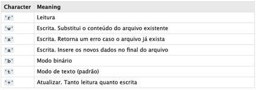

## Entendendo...

    A manipulação de arquivos é um trabalho muito importante para todo o desenvolvedor, seja para alterar um arquivo ou fazer um backup e muitas vezes chega a ser desafiador e, convenhamos, isso da um sabor a tudo! 

    No Python não é diferente e a manipulação de arquivos é mais simples do que você possa imaginar. Por isso, veremos neste capitulo como realizar as principais operações com arquivos utilizando o Python.

    A manipulação de arquivos contém alguns termos importantes e que serão de conhecimento obrigatorio para dominar essa parte dos estudos. A tabela abaixo representa o que foi dito nesse tópico:

    

## Bom saber: 

- A versão principal mais recente do Python é o Python 3, que usaremos neste capitulo, ja que a versão 2 do python foi descontinuada definitivamente.
