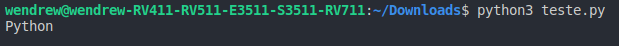
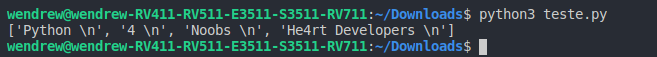
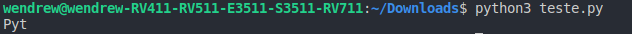

## Lendo dados de arquivos

- Além de abrir e criar um arquivo, precisamos saber mostrar ao usuário o conteúdo do mesmo; 

- Existem duas possibilidades de fazer a leitura, usando o método __readline()__, que mostra uma unica linha do arquivo:

Esse é o conteúdo do nosso arquivo:
<p align="center">
    
</p>

Esse é o retorno no console, após usar o método:
<p align="center">
    
</p>

- A outra possibilidade é usar o método __readlines()__, que trará todo o conteudo do arquivo escolhido:

<p align="center">
    
</p>


## Saiba que...

- Se usar o método __readline()__ e definir um parâmetro para ele, será retornado a quantidade de caracteres equivalentes ao fornecido no metodo. Por exemplo:

```python
In[]:
    arquivo = open("texto.txt", "r")

    print(arquivo.readline(3))
```

O retorno será esse:

```python
Out[]:
```
<p align="center">
    
</p>

Como o método __readline()__ retorna apenas a primeira linha do arquivo, passando um valor inteiro, ele pegará a quantidade de caracteres conforme o inteiro passado como parâmetro.