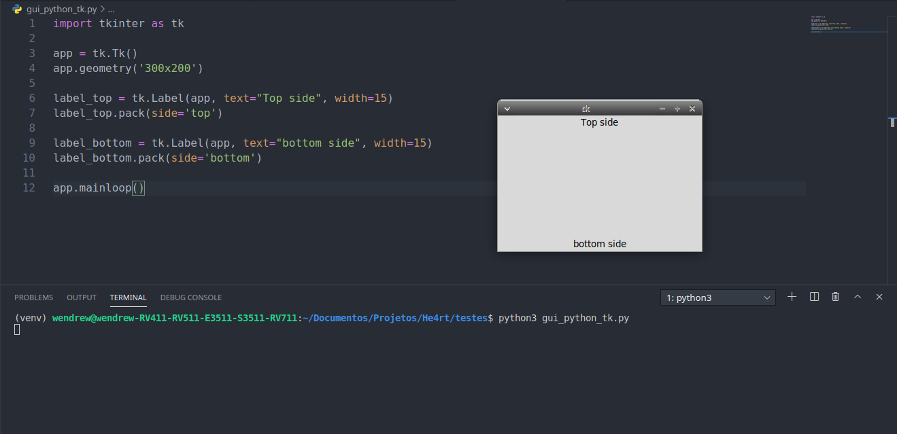
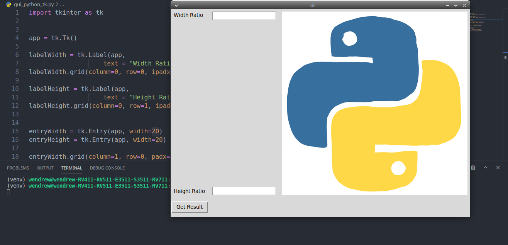

## Gerenciamento do layout e geometria

- Aqui vamos ver como gerenciar e entender a geometria das janelas e widgets de uma aplicação tkinter;

Para isso, vamos listar três pontos importantes:

1. Método __pack__
2. Método __grid__
3. Método __place__

## Método pack

- O método __pack__ empacota/agrupa os widgets dentro da janela.

Vamos ver como funciona na pratica. Iremos adicionar um texto na parte superior e na parte inferior da janela

```python
In[]:

    import tkinter as tk    
    

    app = tk.Tk()
    # Definindo o tamanho padrão da janela
    app.geometry('300x200')

    label_top = tk.Label(app, text="Top side", width=15)
    label_top.pack(side='top')

    label_bottom = tk.Label(app, text="bottom side", width=15)
    label_bottom.pack(side='bottom')

    app.mainloop()
```
```python
Out[]:
```



- Veja que nesse codigo vimos como funciona o método __pack__ e também como definir as dimensoes da janela;

- A propriedade __side__ contém quatro opções:

    - top
    - bottom
    - left
    - right


## Método grid

- Esse método pode ser considerado o mais importante;
- O método __grid__ é costantemente usado em caixas de diálogo. O método de layout grid pode ter posições relativas estáveis de todos os widgets.

O exemplo que vamos ver agora é mais extenso e complexo do que vimos até agora, mas fique tranquilo, pois será tudo explicado na sequencia:

```python
In[]:

    import tkinter as tk    
    

    app = tk.Tk()
    # Definindo o tamanho padrão da janela
    app.geometry('300x200')

    label_top = tk.Label(app, text="Top side", width=15)
    label_top.pack(side='top')

    label_bottom = tk.Label(app, text="bottom side", width=15)
    label_bottom.pack(side='bottom')

    app.mainloop()
```
```python
Out[]:
```


- A coordenada da célula é determinada por __column__ e __row__;
- A widget __labelWidth__ é colocada na célula da *posição (0, 0)*. A coordenada começa a partir do canto superior esquerdo da janela;
- Em alguns casos, você precisa adicionar algum detalhe dentro ou fora do widget para que haja menos congestionamento entre os widgets, e também entre o texto do widget e os limites do widget. Agora, você precisa de opções como __padx__, __pady__, __ipadx__ e __ipadx__;
- O __sticky__ determina, basicamente, como o widget irá se comportar;
    	
    |   Sticky    | Significado |
    | ------------- | -------------  |
    |   W      | virar à esquerda|
    |   E      | ater-se à direita   |
    |   N      | limitar-se ao topo   |
    |   S      | ater-se ao fundo   |

- Veja esse trecho de código abaixo referente as propriedades __columnspan__ e __rowspan__:

```python
In[]:

    labelLogo.grid(row=0, column=2, columnspan=2, rowspan=2,
               sticky=tk.W+tk.E+tk.N+tk.S, padx=5, pady=5)
```

__columnspan=2__ e __rowspan=2__ significa que o widget tem intervalos de duas células tanto em *X* como em *Y*, começando a partir da posição do widget.


## Método place

- O método __place__ coloca o widget em uma posição absoluta ou relativa na janela. Veja o trecho de codigo abaixo:

```python

    import tkinter as tk


    app = tk.Tk()
    app.geometry('300x300') 

    labelA = tk.Label(app, text = "Label (0, 0)", fg="blue", bg="#FF0")
    labelB = tk.Label(app, text = "Label (20, 20)", fg="green", bg="#300")
    labelC = tk.Label(app, text = "Label (40, 50)", fg="black", bg="#f03")
    labelD = tk.Label(app, text = "Label (0.5, 0.5)", fg="orange", bg="#0ff")

    labelA.place(x=0, y=0)
    labelB.place(x=20, y=20)
    labelC.place(x=40, y=50)
    labelD.place(relx=0.5, rely=0.5)

    app.mainloop()

```

- As opções *x=* e *y=* em __place__ determinam as posições absolutas do widget, medidas em pixel. Por exemplo, *lableB.place(x=20, y=20)* significa que *labelB* é colocado na coordenada de *(20, 20)*;
- O problema de utilizar uma posição absoluta é que se a janela for ampliada, outros widgets na janela podem se sobrepor;

Para sanar essa questão, o método __place__ conta com a opção de posição relativa, definido da seguinte forma:

```python

    labelD.place(relx=0.5, rely=0.5)
```

- __relx__ e __rely__ estão na faixa entre 0.0 e 1.0. É a percentagem relativa da posição do widget para o tamanho da janela;
- Por exemplo, __relx=0.5__, __rely=0.5__ significa que o widget é colocado nos 50% da largura da janela e 50% da altura da janela.

