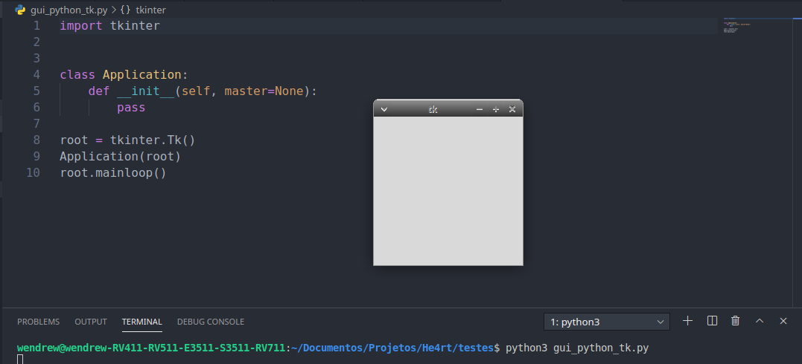
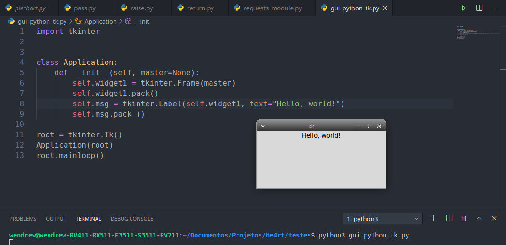

## Hello World


#### Montando a interface

- Podemos criar uma interface simples com __tkinter__, da seguinte forma:

```python
    # importando a biblioteca.
    import tkinter

    # criando a classe principal da aplicação, onde será armazenada as configurações de execução do codigo.
    class Application:
        def __init__(self, master=None):
            pass

    root = tkinter.Tk()

    # Aqui passamos a variável root como parâmetro do método construtor da classe Application
    Application(root)

    # chamamos o método root.mainloop() para exibirmos a tela.
    root.mainloop()
```


<hr>

- Agora, vamos dar uma enfeitada na tela e adicionar nosso __hello world__ nela:

```python
    # importando a biblioteca.
    import tkinter

    # criando a classe principal da aplicação, onde será armazenada as configurações de execução do codigo.
    class Application:
        '''
            O método __init__ representa os valores do construtor.
        '''
        def __init__(self, master=None):
            self.widget1 = tkinter.Frame(master)
            self.widget1.pack()
            self.msg = tkinter.Label(self.widget1, text="Hello, world!")
            self.msg.pack ()

    root = tkinter.Tk()
    
    # Aqui passamos a variável root como parâmetro do método construtor da classe Application
    Application(root)

    # chamamos o método root.mainloop() para exibirmos a tela.
    root.mainloop()
```




Agora que ja temos uma base, podemos ir para o [proximo passo](/Módulo-Tkinter/atributos_padrao.md) e conhecer os atributos padrões do tkinter.