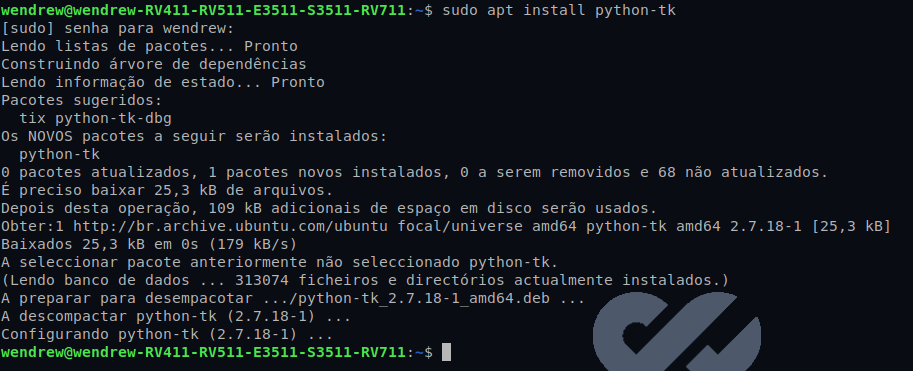

## Interfaces graficas com Python e Tkinter

- __Tkinter__ é a biblioteca *GUI* padrão para Python. O Python, quando combinado com o Tkinter, fornece uma maneira rápida e fácil de criar aplicativos *GUI*. O __Tkinter__ fornece uma poderosa interface orientada a objetos para o kit de ferramentas *Tk GUI*.

__GUI__: abreviadamente, o acrônimo __GUI__, vem do inglês *Graphical User Interface* (*interface gráfica do utilizador*).


Para utilizar tal módulo do python, o mesmo precisa ser instalado em seu OS.

``` sudo apt install python-tk ```

__Obs:__ *Lembrando que, a instalação dessa biblioteca é altamente recomendada para ser usada em ambientes linux, ja que a instalação da mesma em outros OS demanda muito tempo e trabalho de configuração, que no final acabam não valendo a pena.*



Após a instalação concluida, podemos ir para o [proximo passo](/Módulo-Tkinter/hello_world.md).