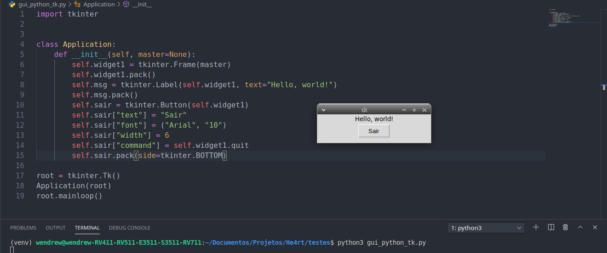

## Posicionamento e atributos


- Quem ja trabalho com *CSS* ja vai ter visto falar, pelo menos, na maioria dos atributos encontrados aqui abaixo:

    - __Width__ – Largura do widget;
    - __Height__ – Altura do widget;
    - __Text__ – Texto a ser exibido no widget;
    - __Font__ – Família da fonte do texto;
    - __Fg__ – Cor do texto do widget;
    - __Bg__ – Cor de fundo do widget;
    - __Side__ – Define em que lado o widget se posicionará (Left, Right, Top, Bottom).

Aproveitando que estamos aqui, vamos testar esses atributos:

```python
In[]:

    import tkinter


    class Application:
        def __init__(self, master=None):
            self.widget1 = tkinter.Frame(master)
            self.widget1.pack()
            self.msg = tkinter.Label(self.widget1, text="Hello, world!")
            self.msg.pack()
            # Criando um botão na janela
            self.sair = tkinter.Button(self.widget1)
            # Definindo um texto para esse botão
            self.sair["text"] = "Sair"
            # Definindo a fonte e o tamanho do texto
            self.sair["font"] = ("Arial", "10")
            # Definindo o tamanho do botão
            self.sair["width"] = 6
            # Definindo a ação que o botão terá
            self.sair["command"] = self.widget1.quit
            # Definindo o posicionamento do botão na janela
            self.sair.pack(side=tkinter.BOTTOM)

    root = tkinter.Tk()
    Application(root)
    root.mainloop()

```



- Ao clicar no botão *SAIR*, a ação atribuida ao mesmo é acionada e a janela se fecha, encerrando a aplicação.