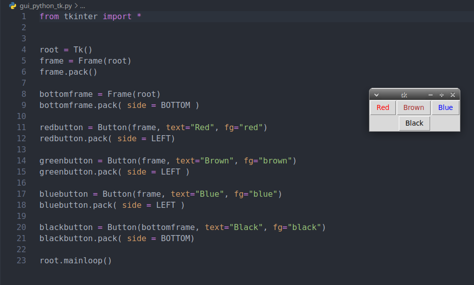
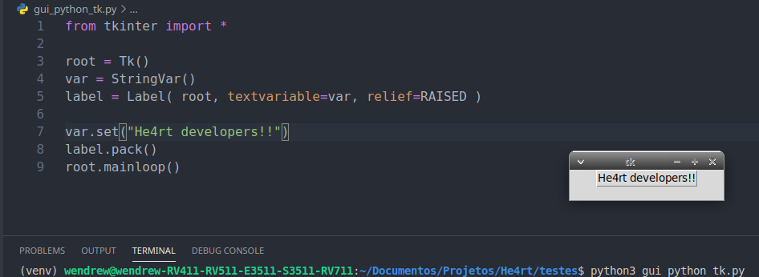
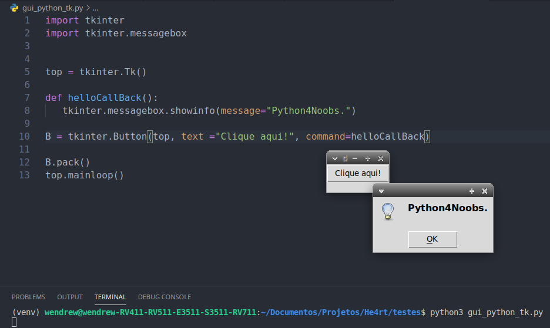
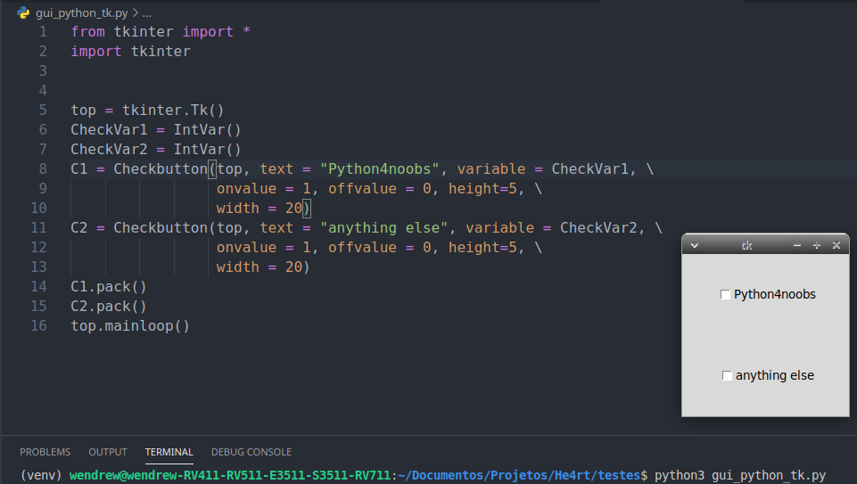
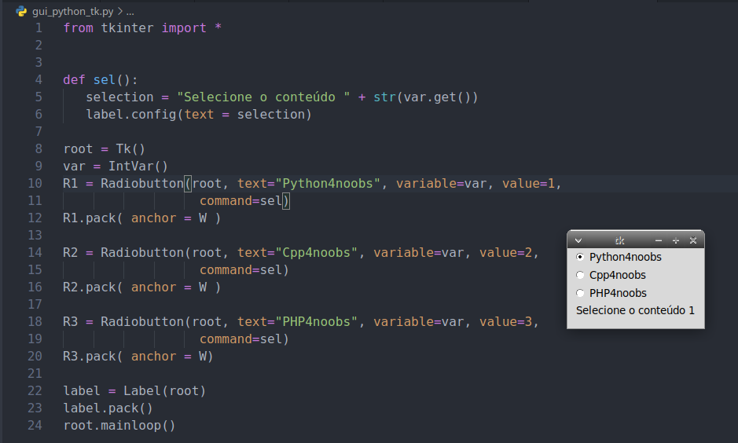
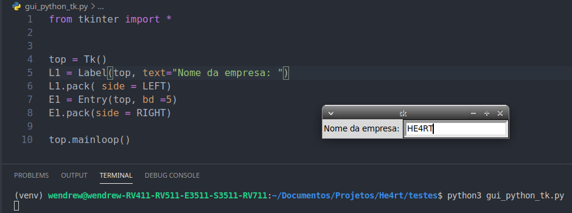
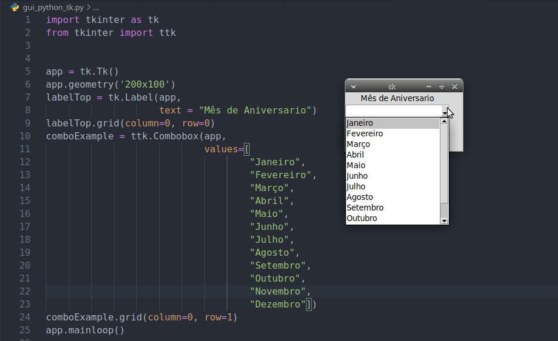

## Widgets 

- Aqui veremos os widgets mais comuns quando usamos a lib tkinter, sendo eles, __frames__, __labels__, __buttons__, __checkbuttons__, __radiobuttons__, __entries__ and __comboboxes__;
- Lembrando que, o tkinter tem muitos widgets, por isso iremos citar os principais e comumente usados em todas as telas de uma aplicação que utiliza essa biblioteca.


## Frames

- Vamos começar pelos __frames__, que são usados, normalmente, para receber outros widgets.

#### Sintaxe

```python

    frame = Frame( master, option, ... )
```

#### Parametros da classe

- __master__ − Representa a janela principal, ou janela pai.
- __options__ − Esse parâmetro é uma lista de opções (como o proprio nome ja diz) para aperfeiçoar o widget.

Acompanhe o exemplo abaixo:

```python
In[]:

    from Tkinter import *

    root = Tk()
    frame = Frame(root)
    frame.pack()

    bottomframe = Frame(root)
    bottomframe.pack( side = BOTTOM )

    redbutton = Button(frame, text="Red", fg="red")
    redbutton.pack( side = LEFT)

    greenbutton = Button(frame, text="Brown", fg="brown")
    greenbutton.pack( side = LEFT )

    bluebutton = Button(frame, text="Blue", fg="blue")
    bluebutton.pack( side = LEFT )

    blackbutton = Button(bottomframe, text="Black", fg="black")
    blackbutton.pack( side = BOTTOM)

    root.mainloop()

```
```python
Out[]
```



## Label

- Um __label__ é um widget que exibe texto ou imagens, normalmente com o qual o usuário apenas visualiza, mas sem interagir com ele.

#### Sintaxe

```python

    lbl = Label( master, option, ... )
```

#### Parâmetros

- __master__ − Representa a janela principal, ou janela pai.
- __options__ − Esse parâmetro é uma lista de opções (como o proprio nome ja diz) para aperfeiçoar o widget.

Acompanhe o exemplo abaixo:

```python
In[]:

    from tkinter import *

    root = Tk()
    var = StringVar()
    label = Label(root, textvariable=var, relief=RAISED)

    var.set("He4rt developers!!")
    label.pack()
    root.mainloop()

```
```python
Out[]
```




## Button

- Um __button__, diferentemente de um quadro ou rótulo, é muito projetado para o usuário interagir e, em particular, pressionar para executar alguma ação. 

#### Sintaxe

```python

    btn = Button(master, option=value, ...)
```

#### Parâmetros

- __master__ − Representa a janela principal, ou janela pai.
- __options__ − Esse parâmetro é uma lista de opções (como o proprio nome ja diz) para aperfeiçoar o widget.


Exemplo:

```python
In[]:

    import tkinter
    import tkinter.messagebox


    top = tkinter.Tk()

    def helloCallBack():
    tkinter.messagebox.showinfo(message="Python4Noobs.")

    B = tkinter.Button(top, text ="Clique aqui!", command=helloCallBack)

    B.pack()
    top.mainloop()

```
```python
Out[]
```




## Checkbutton

- Os __checkbuttons__ são como um botão comum, exceto que o usuário não apenas pode pressioná-lo, o que invocará um retorno de chamada de comando, mas também possui um valor binário de algum tipo (ou seja, uma alternância).

#### Sintaxe

```python

    cb = Checkbutton(master, option, ...)
```

#### Parâmetros

- __master__ − Representa a janela principal, ou janela pai.
- __options__ − Esse parâmetro é uma lista de opções (como o proprio nome ja diz) para aperfeiçoar o widget.


Exemplo:

```python
In[]:

    from tkinter import *
    import tkinter


    top = tkinter.Tk()
    CheckVar1 = IntVar()
    CheckVar2 = IntVar()
    C1 = Checkbutton(top, text = "Python4noobs", variable = CheckVar1, \
                    onvalue = 1, offvalue = 0, height=5, \
                    width = 20)
    C2 = Checkbutton(top, text = "anything else", variable = CheckVar2, \
                    onvalue = 1, offvalue = 0, height=5, \
                    width = 20)
    C1.pack()
    C2.pack()
    top.mainloop()

```
```python
Out[]
```



https://tkdocs.com/tutorial/widgets.html
https://www.tutorialspoint.com/python/tk_frame.html


## Radiobutton

- Um __radiobutton__ lhe permite escolher uma opção entre varias, mutuamente exclusivas.

#### Sintaxe

```python

    rb = Radiobutton(master, option, ...)
```

#### Parâmetros

- __master__ − Representa a janela principal, ou janela pai.
- __options__ − Esse parâmetro é uma lista de opções (como o proprio nome ja diz) para aperfeiçoar o widget.


Exemplo:

```python
In[]:

    from tkinter import *


    def sel():
        selection = "Selecione o conteúdo " + str(var.get())
        label.config(text = selection)

    root = Tk()
    var = IntVar()
    R1 = Radiobutton(root, text="Python4noobs", variable=var, value=1,
                    command=sel)
    R1.pack( anchor = W )

    R2 = Radiobutton(root, text="Cpp4noobs", variable=var, value=2,
                    command=sel)
    R2.pack( anchor = W )

    R3 = Radiobutton(root, text="PHP4noobs", variable=var, value=3,
                    command=sel)
    R3.pack( anchor = W)

    label = Label(root)
    label.pack()
    root.mainloop()
```
```python
Out[]
```




## Entry

- Um __Entry__ apresenta ao usuário um campo de texto de linha única que ele pode usar para digitar um valor. Podem ser praticamente qualquer coisa: nome, cidade, senha, número do seguro social e assim por diante.


#### Sintaxe

```python

    entry = Entry(master, option, ...)
```

#### Parâmetros

- __master__ − Representa a janela principal, ou janela pai.
- __options__ − Esse parâmetro é uma lista de opções (como o proprio nome ja diz) para aperfeiçoar o widget.


Exemplo:

```python
In[]:

    from tkinter import *


    top = Tk()
    L1 = Label(top, text="Nome da empresa: ")
    L1.pack( side = LEFT)
    E1 = Entry(top, bd =5)
    E1.pack(side = RIGHT)

    top.mainloop()
```
```python
Out[]
```




## Combobox

- Os __combobox__ combina o componente __entry__ com uma lista de opções disponíveis para o usuário. Isso permite que você escolha um conjunto de valores que você forneceu.


#### Sintaxe

```python

    combobox = Combobox(master, option, ...)
```

#### Parâmetros

- __master__ − Representa a janela principal, ou janela pai.
- __options__ − Esse parâmetro é uma lista de opções (como o proprio nome ja diz) para aperfeiçoar o widget.


Exemplo:

```python
In[]:

    from tkinter import *


    top = Tk()
    L1 = Label(top, text="Nome da empresa: ")
    L1.pack( side = LEFT)
    E1 = Entry(top, bd =5)
    E1.pack(side = RIGHT)

    top.mainloop()
```
```python
Out[]
```

