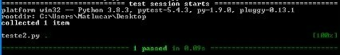
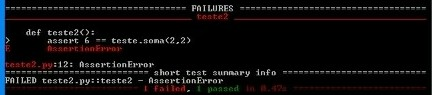

# Realizando testes em funções

Para começarmos é necessário que você:

- Abra seu editor de código favorito
- Crie dois arquivos .py com os nomes: teste e teste2
- Salva os dois arquivos no mesmo diretório
- Abra o diretório dos arquivos pelo terminal
- Certifique-se que a biblioteca pytest está instalada

## Hora do código

No script de nome teste crie uma simples função de soma.

<code>

    def soma(a,b):
        return a+b
    
</code>
Agora, no script teste2 iremos realizar nosso primeiro teste.
 
 
<b>OBS: </b>Certifique-se, que os dois .py estão nos mesmo diretório.
<code>
    
    #Importando a biblioteca pytest
    import pytest
    #Importando o .py com a função de soma
    import teste

    #primeiro teste
    def teste1():
        assert 5 == teste.soma(3,2)

</code> 
Salve os dois .py e execute via terminal o teste2.

<code>

    pytest teste2.py
</code>
Essa será sua saída:
 
 

 
Podemos, vê que nossa função de soma passou no teste, afinal três mais dois resulta realmente em cinco.

## Teste com erro

Agora no teste2, vamos escrever um teste com erro.

<code>

    #Importando a biblioteca pytest
    import pytest
    #Importando o .py com a função de soma
    import teste

    #primeiro teste
    def teste1():
        assert 5 == teste.soma(3,2)

    #teste com erro
    def teste2():
        assert 6 == teste.soma(2,2)

</code>
Salve o teste2.py 
E excute via terminal novamente.
 
 

Um teste não passou e outro sim, ou seja, foi uma saída e esperada nossos testes funcionaram.