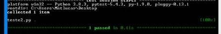
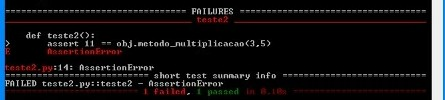

# Realizando testes em métodos

Para começarmos é necessário que você:

- Abra seu editor de código favorito
- Crie dois arquivos .py com os nomes: teste e teste2
- Salva os dois arquivos no mesmo diretório
- Abra o diretório dos arquivos pelo terminal
- Certifique-se que a biblioteca pytest está instalada

## Hora do código 

No arquivo teste criaremos o método que será testado.

<b>OBS: </b>Lembre-se, que o método é a função de uma classe, então, para isso criaremos uma classe.

<code>

    #Classe teste
    class teste():

    #Método de multiplicação da classe teste
    def metodo_multiplicacao(self,a,b):
        return a * b

</code>
Agora no arquivo teste2 criaremos os testes.

<code>

    #Importando a biblioteca pytest
    import pytest
    #Importando o .py com a função de soma
    import teste
    
    #objeto da classe teste
    obj = teste.teste()
    
    #primeiro teste
    def teste1():
        assert 10 == obj.metodo_multiplicacao(2,5)

</code>
Agora, basta executar o teste2 e observar o resultado.
 
 

 
 
O teste passou com sucesso, afinal, dois vezes cinco é realmente dez.

## Teste com erro

Vamos realizar agora um teste com erro.

<code>
    
    #teste com erro
    def teste2():
        assert 11 == obj.metodo_multiplicacao(3,5)
</code>
Salve e execute o arquivo teste2.
 
 

 
 
Podemos ver que um teste passou e outro não, então, tivemos o resultado esperado.