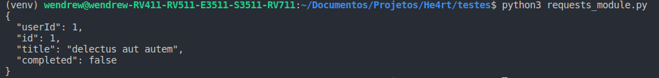
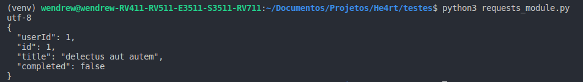

## Conteúdo da resposta

- Podemos ler o que o servidor retornou, quando fizemos um requisição. Para isso, existem algumas formas de realizar tal leitura, por exemplo:

```python
In[]:

    import requests


    # Aqui vamos utilizar uma API publica.
    r = requests.get('https://jsonplaceholder.typicode.com/todos/1')
    # Utilizamos o tratamento de retorno em forma de texto plano.
    print(r.text)

```
```python
Out[]:
```


- O encoding do conteúdo costuma ser automatico baseada nos cabeçalhos HTTP, mas você pode descobrir qual codificação *Requests* está usando, e mudá-la, utilizando a propriedade __r.encoding__:

```python
In[]:

    import requests

    
    r = requests.get('https://jsonplaceholder.typicode.com/todos/1')
    # Retornando o encode da resposta.
    print(r.encoding)
    # Alterando o tipo do econde
    r.encoding = "ISO-8859-1"
    print(r.text)

```
```python
Out[]:
```


Se você mudar a codificação, *Requests* irá usar o novo valor de __r.encoding__ sempre que você chamar __r.text__.