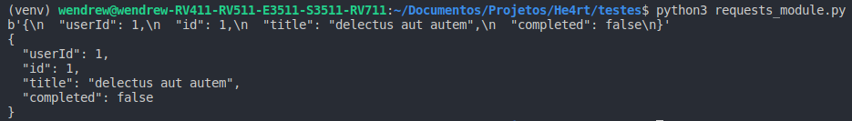

## Resposta binária

- Você pode acessar o corpo da resposta como bytes, para requisições que não são textos:

```python
In[]:

    import requests


    r = requests.get('https://jsonplaceholder.typicode.com/todos/1')
    print(r.content)
```
```
Out[]:
```


- As codificações de transferências *gzip* e *deflate* são decodificadas automaticamente para você.