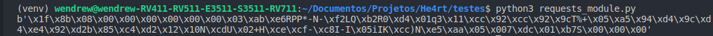

## Resposta crua

- Caso seja necessario retornar a resposta crua do servidor, podemos usar o __raw__ para isso:

```python
In[]:

    import requests


    r = requests.get('https://jsonplaceholder.typicode.com/todos/1')
    print(r.raw)
```
```python
Out[]:

    <urllib3.response.HTTPResponse object at 0x7f7e44899700>
```

- O conteudo retorna acima é um objeto da resposta do servidor. Para obter a resposta crua de fato, devemos incluir o parâmetro *stream=True* e atribuir ao método __r.raw__ a função __read()__, onde pconseguimos, de fato, o retorno "cru" do servidor:

```python
In[]:

    import requests


    r = requests.get('https://jsonplaceholder.typicode.com/todos/1', stream=True)
    print(r.raw.read())
```
```python
Out[]:
```

