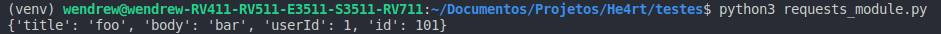

## Cabeçalhos personalizados

- Podemos adicionar cabeçalhos a uma requisição, para isso basta criar um __dict__, especificando os valores a serem utilizados:

```python
    import requests
    import json


    url = 'https://jsonplaceholder.typicode.com/posts'
    payload = {
        'title': 'foo',
        'body': 'bar',
        'userId': 1
    }
    headers = {'content-type': 'application/json'}
    r = requests.post(url, data=json.dumps(payload), headers=headers)
    print(r)
```
```python
Out[]:
```


Dessa forma, passamos os valores de um formulário pelo headers da *URL* e criamos um novo registro na *API*.